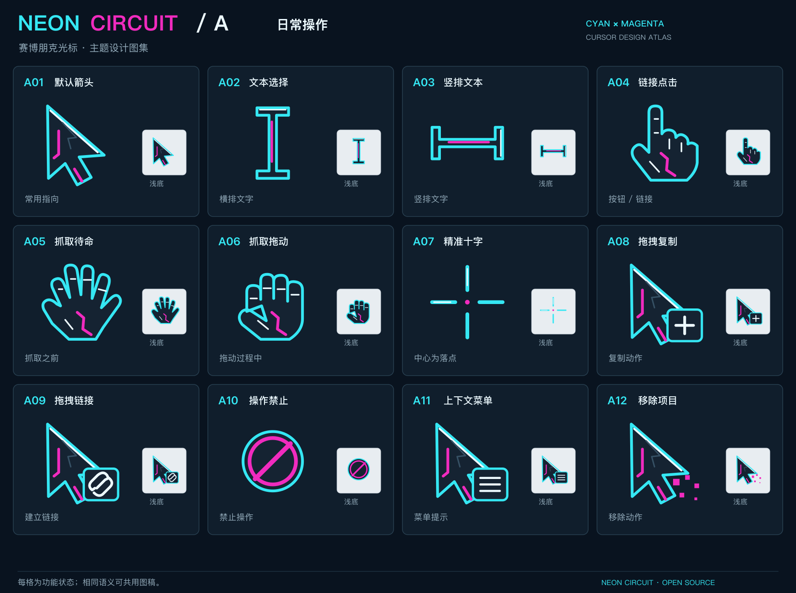
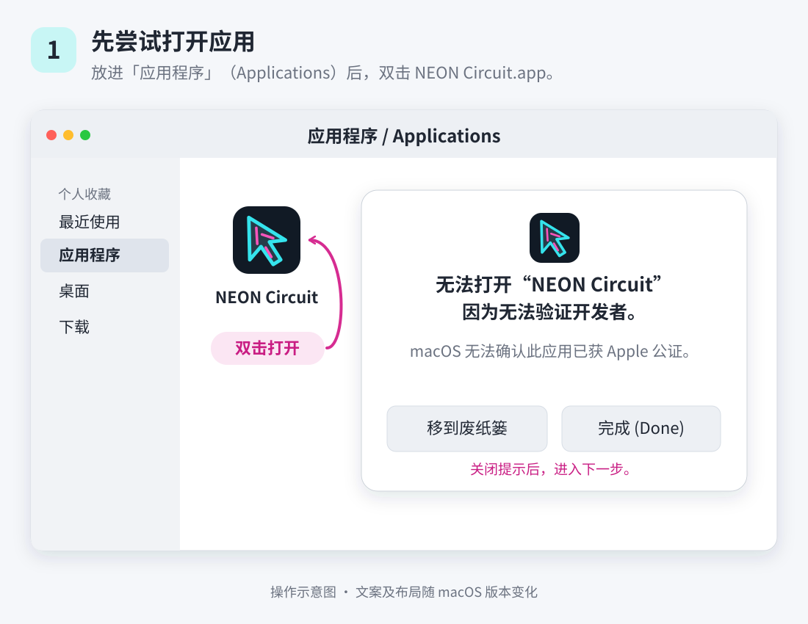
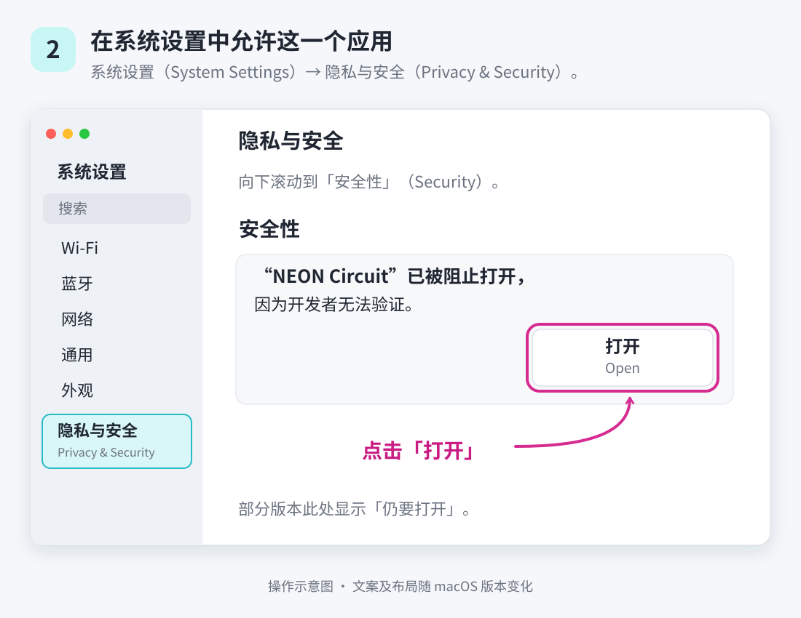
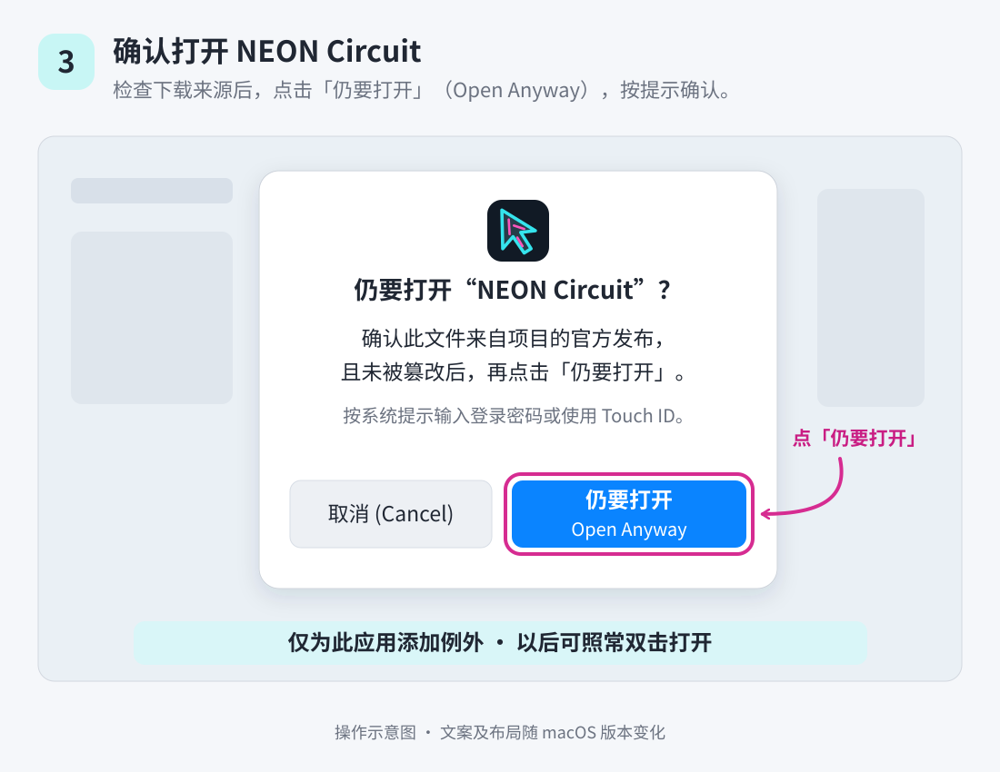
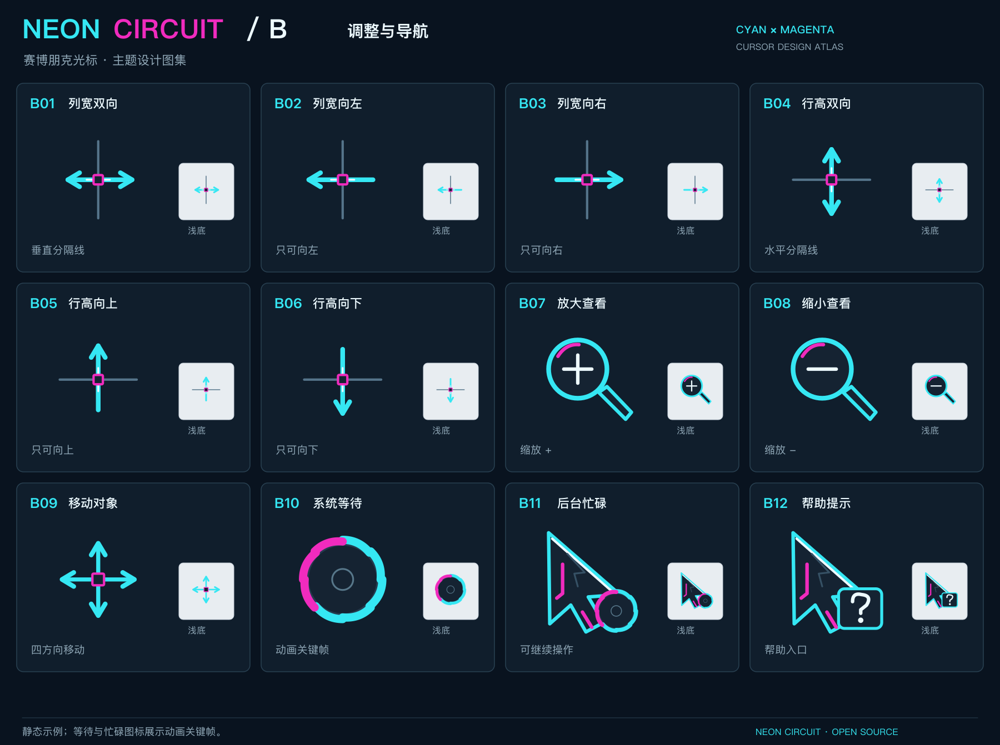
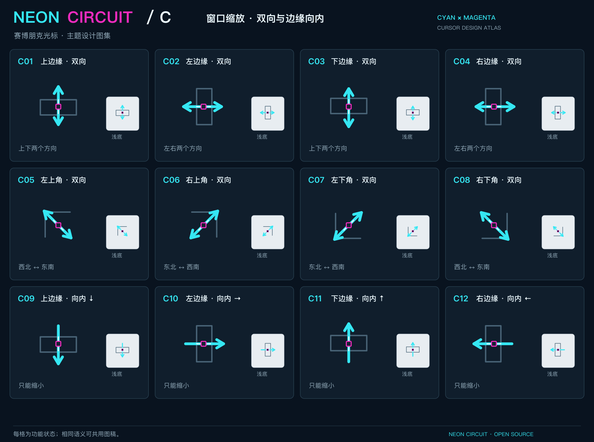
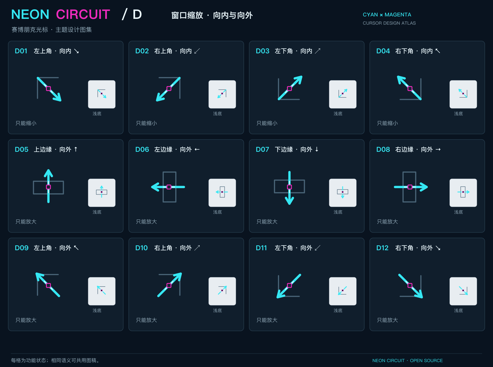
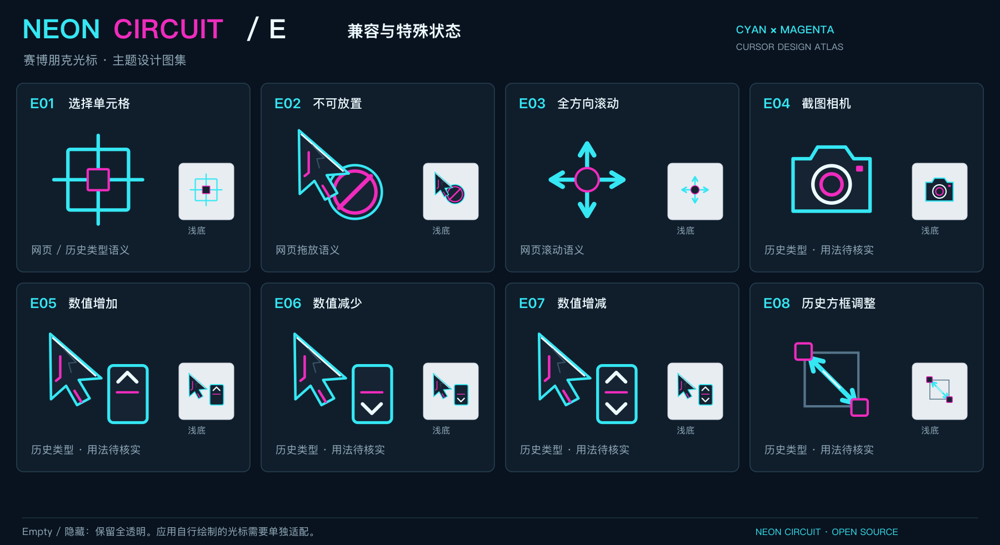

# NEON Circuit

开源 macOS 赛博朋克光标。青色轮廓、洋红电路、石墨色结构，把日常指针、文本选择、抓取、缩放和后台忙碌状态换成同一套视觉语言。

**0.1.0 preview 使用 ad hoc 签名，尚未获得 Developer ID 签名与 Apple 公证。首次打开可能需要在“隐私与安全”中批准这个应用；下面提供完整步骤与示意图。**

[下载 0.1.0 预览版](https://github.com/YorenZZZ/neon-circuit/releases/tag/v0.1.0-preview) · [English](README.en.md) · [兼容性](docs/compatibility.md) · [构建与发布](docs/distribution.md) · [MIT License](LICENSE)



## 下载与安装

**首次打开应用后自动生效。下载文件本身不会运行程序，也不会改变光标。**

1. 打开 [0.1.0 预览版 Release](https://github.com/YorenZZZ/neon-circuit/releases/tag/v0.1.0-preview)，下载 `NEON-Circuit-0.1.0-preview-universal.zip` 或 `.dmg`。GitHub 的 **Code → Download ZIP** 和 Release 的 **Source code** 是源码，不是应用安装包。
2. ZIP：解压后，将 **NEON Circuit.app** 拖进 **Applications（应用程序）**。DMG：打开磁盘映像，将应用拖进 Applications，再推出磁盘映像。
3. 从 Applications 双击打开 **NEON Circuit**。如果 macOS 阻止打开，请按下面的首次打开教程操作。
4. 应用进入菜单栏，完成兼容性检查，然后依次 **备份当前光标 → 应用主题 → 读取并核对**。看到已应用状态后即可使用。
5. 希望每次登录后自动生效时，在菜单栏勾选 **Launch at Login（登录时启动）**。新安装默认关闭；系统如要求批准，请在系统设置的登录项中允许。

当前实测环境为 **Apple Silicon · macOS 27.0（26A428）**。其他系统和 Intel Mac 的状态见 [兼容性说明](docs/compatibility.md)。

## 首次打开：在“隐私与安全”中允许

下面三张图是**操作示意图，不是 macOS 实拍截图**，按当前支持的 macOS 27 操作顺序编写。本流程适用于无法验证开发者或无法检查恶意软件的未公证提示，前提是你确认应用来自本项目的 Release 且未被篡改。[Apple macOS 27 官方步骤](https://support.apple.com/zh-cn/guide/mac-help/mh40616/mac)

### 第 1 步：先尝试打开应用

双击 Applications 中的 **NEON Circuit.app**。出现未公证或无法验证开发者的提示时，先关闭提示；这次打开尝试会让系统设置显示对应应用的批准入口。



### 第 2 步：在“安全性”中点击“打开”

进入 **系统设置 → 隐私与安全（Privacy & Security）**，向下滚动到 **安全性** 区域。在 **NEON Circuit** 对应的提示旁点击 **打开（Open）**。

批准按钮在首次尝试打开后一小时内可用；若已过时，重新尝试打开应用，再回到设置。



### 第 3 步：点击“仍要打开”并验证

点击 **仍要打开（Open Anyway）**，输入你的登录密码，再点击 **好（OK）**。系统会为这一个应用保存例外，之后通常可以直接双击打开。



部分旧版 macOS 的按钮顺序是 **仍要打开 → 打开**；请按对应系统的提示操作。本项目的运行支持范围仍为 macOS 27。

企业或学校管理的 Mac 可能受管理员策略限制，无法看到或使用此按钮。若提示为**应用已损坏、将损坏电脑或已检测到恶意软件**，请停止安装并核对下载来源；不要将这类提示当作上述未公证提示继续操作。应用能打开也不代表兼容性已扩展，仍请查看 [已验证范围](docs/compatibility.md)。

## 日常使用

NEON Circuit 是菜单栏应用，没有常驻主窗口。点击菜单栏的光标图标即可管理主题。

| 菜单操作 | 作用 |
| --- | --- |
| Reapply Theme（重新应用主题） | 应用并核对主题，同时重新开启后续自动应用。 |
| Restore Original Cursors（恢复原始光标） | 恢复首次备份的光标并核对，同时关闭后续自动应用。若恢复未能核对，应用显示失败，保留备份供重试。 |
| Launch at Login（登录时启动） | 由你选择是否注册登录项。 |
| Open Backup Folder（打开备份文件夹） | 查看当前用户的恢复文件和最近一次操作记录。 |
| Getting Started / Help（使用说明） | 在应用内查看简要说明。 |
| Quit（退出） | 关闭菜单栏应用；当前会话中的光标继续保留至会话光标重置或重启。需要恢复时，请先选择恢复操作。 |

主题启用时，应用会在睡眠唤醒或会话重新激活后重新应用。恢复光标后，这项自动应用会停止。

第一次应用之前会保存当前会话中的光标，作为恢复基线。若你正在使用另一款光标工具或旧版主题，请先通过那款工具恢复 macOS 原生光标、退出该工具并重启，确认原生状态后再首次打开 NEON Circuit。这样备份才是你预期的原生状态。

备份与操作记录只保存在当前用户的 `~/Library/Application Support/NEON Circuit/`。不要在恢复前删除备份。应用会检查备份；备份不完整或系统构建号与备份环境不符时，操作会停止并显示错误。系统更新前的准备和更新后的处理见 [兼容性说明](docs/compatibility.md#系统更新与反馈)。

## 示例图

以下是主题设计图集，展示不同功能状态及深浅背景下的视觉效果。它们不是所有应用中的实际截图：当前主题覆盖 **50 个系统光标注册位**，图集共有 **56 种设计状态**，部分兼容设计和特殊状态不会由当前系统替换接口使用。

### 调整与导航



图中的等待与忙碌为动画关键帧。**当前版本保留 macOS 原生等待彩球**；后台忙碌动画可替换。等待设计 B10 展示的是主题稿，并不表示系统彩球已被替换。

<details>
<summary>查看更多：窗口缩放、边缘与特殊状态</summary>

**窗口缩放：双向与边缘向内**



**窗口缩放：向内与向外**



**兼容与特殊状态设计**



</details>

## 常见问题

**为什么有些光标没有改变？** 这个工具替换当前登录会话中的系统光标注册位。软件自行绘制的指针、网页自定义图像光标、游戏准星，以及 FileVault 解锁或登录前界面不在覆盖范围内。某些状态只有应用主动使用对应系统光标时才会出现。

**启动后没有生效怎么办？** 点击菜单栏检查状态，再使用重新应用操作。若应用报告版本或光标接口不兼容，请先保留原生状态，并查阅 [兼容性说明](docs/compatibility.md)。不要同时让多个光标工具自动应用主题。

**恢复之后，下次启动会再次变成主题吗？** 不会。恢复操作会记住你的选择；只有再次选择重新应用主题，才会开启主题和后续自动应用。

**怎样卸载？** 先恢复光标并等待核对成功，再关闭登录时启动，退出应用，最后从 Applications 删除 NEON Circuit.app。建议先保留恢复备份。

**需要联网或上传数据吗？** 应用的光标操作、备份、核对和设置均在本机完成，不包含账户、遥测或自动更新服务。macOS 对下载应用的签名检查由系统执行。

## 从源码构建

需要 macOS 和 Apple 的 Xcode Command Line Tools；主题、图标和示例图已预置，不需要 Node.js、Python 或额外依赖。下载或克隆源码，在终端进入项目目录：

```sh
# 仅在尚未安装 Command Line Tools 时执行
xcode-select --install
./scripts/build.sh
open "build/NEON Circuit.app"
# 可选：在本机生成 ZIP 和 DMG
./scripts/package.sh
```

构建脚本生成 `build/NEON Circuit.app`；打包脚本生成 `dist/` 中的 preview ZIP 和 DMG，不会自行上传或发布。构建目标为包含 `arm64` 与 `x86_64` 的 Universal 应用；Intel 编译产物不等于 Intel 运行验证。当前 preview 为 ad hoc 签名、未公证；后续 Developer ID 签名发行流程见 [构建与发布](docs/distribution.md)。

## 开源与致谢

应用源码与本项目原创主题资产采用 [MIT License](LICENSE)。光标接口的研究和兼容处理参考了 [Mousecape](https://github.com/alexzielenski/Mousecape) 社区的工作；本项目不捆绑或分发 Mousecape 应用。macOS 光标替换依赖非公开系统接口，系统升级后需要重新验证。

提交兼容性反馈时，请附上 Mac 芯片、macOS 版本与构建号、应用版本，以及失败操作和菜单栏提示。请勿附带完整个人路径、原生光标备份或未经检查的操作日志。
